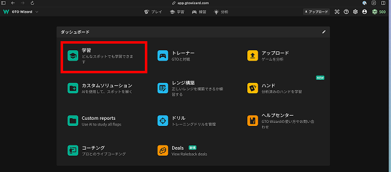
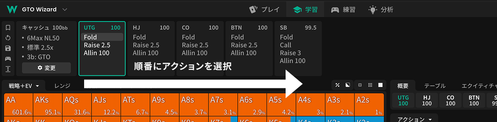
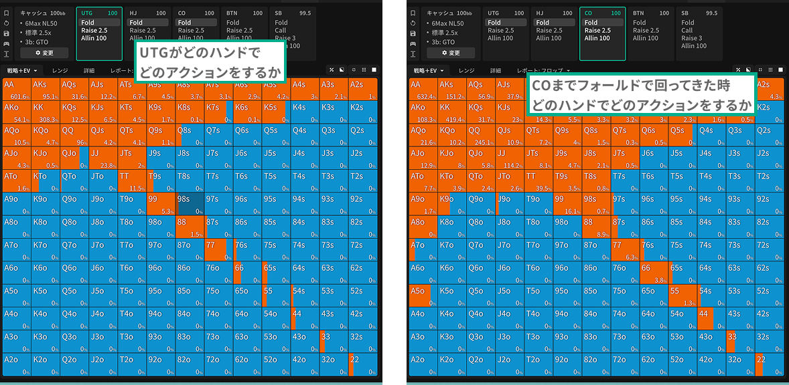
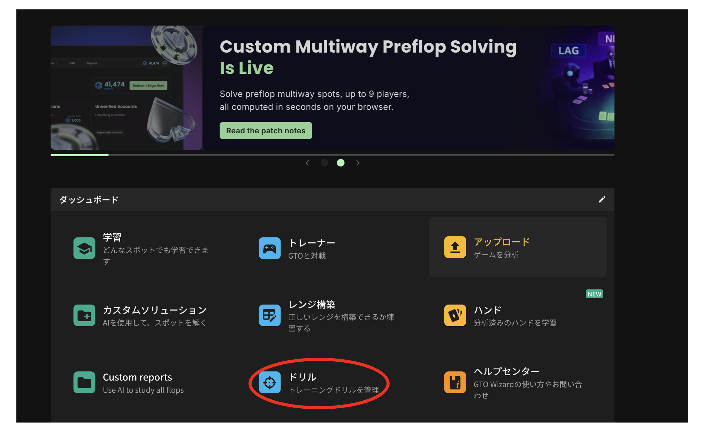
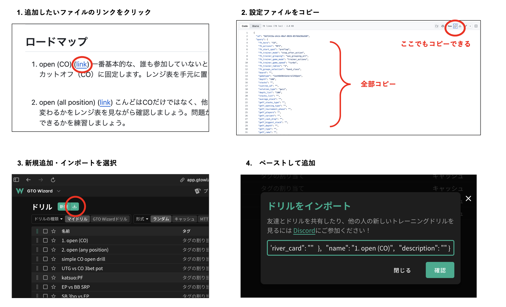

# プリフロップの練習

## はじめに

もっともコスパの良くポーカーの上達するにはプリフロップを練習することです。参加したときだけプレイすることになるポストフロップとは違い、プリフロップは毎回必ずプレイするため、そこでのミスが減らすことはとても大切です。
また、プロと一定戦える程度までならば、反復練習で比較的短期間で習熟しやすいのもプリフロップの特徴です。
まずは「どのポジションで、どのハンドをオープンするか」を正確に判断できるようにしましょう。ここが安定すると、以降のポストフロップ判断もかなり楽になります。

[参考・プリフロップのレンジをまとめたファイル](https://docs.google.com/presentation/d/1asUubTBue9_65OeG2oWMoRu87aWx99yk/edit?slide=id.p1#slide=id.p1)

 

## ロードマップ

プリフロップを自信をもってプレイができるようになるために、練習をしましょう。
簡単なところから少しずつ広げていけるように、順番にトレーニングメニューを配置しています。一個ずつ取り組んで、安定して高得点がとれるまで練習して、ステップアップしていきましょう。

1.  open (CO) ([link](<https://github.com/tika0123/poker-beginner-course/blob/main/drills/1.%20open%20(CO).json>))
    一番基本的な、誰も参加していないときにどのハンドでオープンするかを練習します。まずは慣れるため、ポジションはカットオフ（CO）に固定します。レンジ表を手元に置きながら、

 

2.  open (all position) ([link](<https://github.com/tika0123/poker-beginner-course/blob/main/drills/2.%20open%20(all%20position).json>))
    こんどはCOだけではなく、他のポジションもランダムに出題されます。ポジションごとにオープンレンジがどう変わるかをレンジ表を見ながら確認しましょう。問題が出されたら、SB、BB，自分のポジションを確認して、ポジションに応じてどういうハンドでオープンできるかを練習して慣れていきましょう。

 

（続く）

## レンジの確認の仕方

### 1. 学習モードに入る

### 2. 【重要】　ソリューション設定を確認する

今は意味がわからないかもしれませんが、これ通りに設定をしましょう。

### 3. レンジを見る

上のバーでアクションを順番に選んでいきます。

その時の手番（アクティブ）のプレイヤーの、アクションが表示されます。

プリフロップ用に紹介していますが、フロップ以降もアクションやカードを入れていったらどんなプレイが計算上最適化が表示されます。色々といじって試してみましょう。

## 使い方

### トレーニングモード

ここ

### インポートの仕方

### 設定もできます

スピードとか、停止するかとか、諸々、必要に応じて適宜設定してください。

